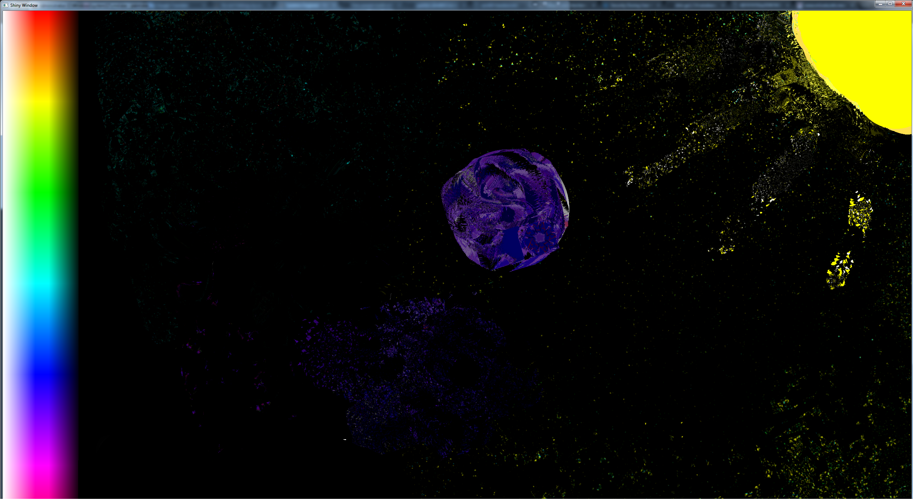

## paint
Multiplayer paint


## Install

```
go install github.com/as/paint 
```

## Server

```
./paint
  ```

## Client(s)

```
./paint -s server:443
```

## Use
```
Mouse
Right: Draw
Left: Pick
Middle: Mix

Kbd
Up: Increase
Down: Decrease
```
